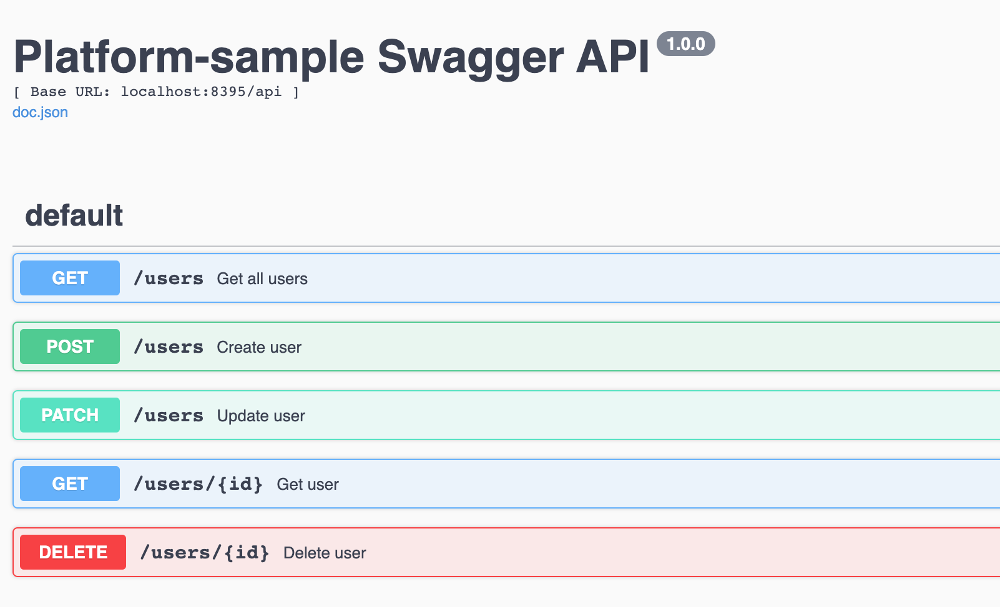

# Swagger

API 문서화 자동화 Tool<br>

## 환경

```sh
$ go get github.com/swaggo/swag/cmd/swag 
$ go get github.com/swaggo/echo-swagger

$ swag init
```

- 참고 <br>
orm library [gorm](https://gorm.io/index.html) 을 사용하게되면 gorm model을 찾지 못해서 ```$ swag init``` 을 사용시 
```ParseComment error :cannot find type definition: gorm.Model```에러가 발생한다. <br>
따라서 ```$ swag init``` 대신 <br>
```$ swag init --parseDependency --parseInternal ```을 사용해준다.
  
  
## Code

main.go
```go
// @title Platform-sample Swagger API
// @version 1.0.0
// @host localhost:8395
// @BasePath /api
func main(){

}
```

server.go
```go
// swagger setting
e.GET("/swagger/*", echoSwagger.WrapHandler)
```

handler 함수 위치에 작성
```go
// @Summary Get user
// @Description Get user's info
// @Accept json
// @Produce json
// @Param id path string true "id of the user"
// @Success 200 {object} model.User
// @Router /users/{id} [get]
func (userController *UserController) GetUser(c echo.Context) error {
	id, err := strconv.Atoi(c.Param("id"))
	if err != nil {
		return c.JSON(http.StatusBadRequest, err)
	}

	user, err := userController.UserService.GetUser(id)
	if err != nil {
		return c.JSON(http.StatusInternalServerError, err)
	}
	return c.JSON(http.StatusOK, user)
}
```


## 사용법

```sh
http://localhost:8395/swagger/index.html
```




